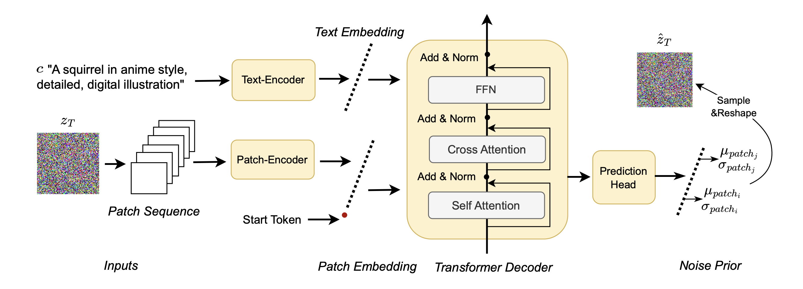

# NoiseAR: AutoRegressing Initial Noise Prior for Diffusion Models
[Zeming Li](https://www.zemingli.com/)$^{\*}$ [Xiangyue Liu](https://xiangyueliu.github.io/)$^{{\*}}$, [Xiangyu Zhang](https://scholar.google.com/citations?user=yuB-cfoAAAAJ&hl=zh-CN), [Ping Tan](https://pingtan.people.ust.hk/index.html), [Heung-Yeung Shum](https://scholar.google.com.hk/citations?user=9akH-n8AAAAJ&hl=en)

<a href=""></a> 

<div align=center>

</div>

## Getting Started 

### 1. Download Documents for Setting Up the Environment, Our Pretrained Models, and Eval Datasets (Compulsory)

```bash
bash download.sh
```

### 2. Set Up Your Development Environment

```bash
conda create --name noise_ar python=3.10.8 
conda activate noise_ar
make install
```

### 3. Run Inference 

For example, to run inference using SDXL with our trained model:
```bash
python try.py
```

### 4. Run Evaluation Metrics

For example, run eval using SDXL with our trained model on DrawBench Evaluation Dataset:
```bash
torchrun eval.py exp.suffix=eval_sdxl_DrawBench exp.pretrained_path=pretrained_models/sdxl_and_dreamshaper/model.pth exp.val_data_path=data/DrawBench
```

<details> 
<summary>Click to expand for all of our evaluation commands</summary>

```bash
# SDXL on GenEval, DrawBench, PickaPic
torchrun --master_port 13340 eval.py exp.suffix=eval_sdxl_DrawBench exp.pretrained_path=pretrained_models/sdxl_and_dreamshaper/model.pth exp.val_data_path=data/DrawBench
torchrun --master_port 13341 eval.py exp.suffix=eval_sdxl_GenEval exp.pretrained_path=pretrained_models/sdxl_and_dreamshaper/model.pth exp.val_data_path=data/GenEval
torchrun --master_port 13342 eval.py exp.suffix=eval_sdxl_PickaPic exp.pretrained_path=pretrained_models/sdxl_and_dreamshaper/model.pth exp.val_data_path=data/PickaPic

# DreamShaper on GenEval, DrawBench, PickaPic
torchrun --master_port 13343 eval.py exp.suffix=eval_dreamshaper_DrawBench exp.pipeline=DreamShaper exp.pretrained_path=pretrained_models/sdxl_and_dreamshaper/model.pth exp.val_data_path=data/DrawBench exp.cfg=3.5
torchrun --master_port 13344 eval.py exp.suffix=eval_dreamshaper_GenEval exp.pipeline=DreamShaper  exp.pretrained_path=pretrained_models/sdxl_and_dreamshaper/model.pth exp.val_data_path=data/GenEval exp.cfg=5.0
torchrun --master_port 13345 eval.py exp.suffix=eval_dreamshaper_PickaPic exp.pipeline=DreamShaper  exp.pretrained_path=pretrained_models/sdxl_and_dreamshaper/model.pth exp.val_data_path=data/PickaPic exp.cfg=5.0

# DiT on GenEval, DrawBench, PickaPic
torchrun --master_port 13346  eval.py exp.suffix=eval_dit_DrawBench exp.pipeline=DiT exp.pretrained_path=pretrained_models/dit/model.pth exp.val_data_path=data/DrawBench 
torchrun --master_port 13347  eval.py exp.suffix=eval_dit_GenEval exp.pipeline=DiT  exp.pretrained_path=pretrained_models/dit/model.pth exp.val_data_path=data/GenEval
torchrun --master_port 13348  eval.py exp.suffix=eval_dit_PickaPic exp.pipeline=DiT  exp.pretrained_path=pretrained_models/dit/model.pth exp.val_data_path=data/PickaPic 

# DPO of SDXL, DreamShaper, DiT on DrawBench
torchrun --master_port 13349 eval.py exp.suffix=eval_sdxl_DrawBench_DPO exp.pretrained_path=pretrained_models/sdxl_and_dreamshaper_dpo/model.pth exp.val_data_path=data/DrawBench
torchrun --master_port 13350 eval.py exp.suffix=eval_dreamshaper_DrawBench_DPO exp.pipeline=DreamShaper exp.pretrained_path=pretrained_models/sdxl_and_dreamshaper_dpo/model.pth exp.val_data_path=data/DrawBench
torchrun --master_port 13351 eval.py exp.suffix=eval_dit_DrawBench_DPO exp.pipeline=DiT exp.pretrained_path=pretrained_models/dit_dpo/model.pth exp.val_data_path=data/DrawBench exp.cfg=5.0
```
</details>


## 🚧 Todo
- [ ] Release the training code & data.
- [ ] Release the training code & data for DPO.

## 📍 Citation 
If you find this project useful for your research, please cite: 

```

```